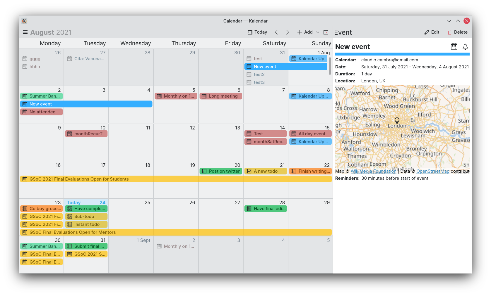
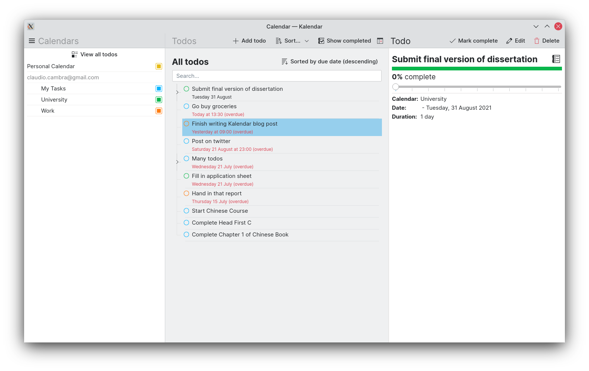
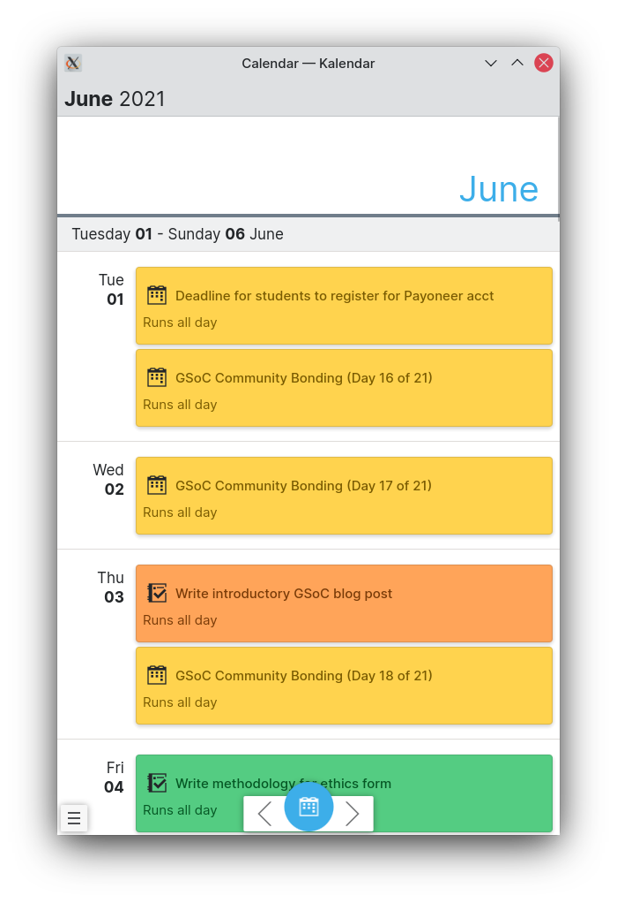

# Kalendar

Kalendar is a Kirigami-based calendar application that uses Akonadi. It lets you add, edit and delete events from local and remote accounts of your choice, while keeping changes syncronised across your Plasma desktop or phone.

**Kalendar is still under heavy development, and has no stable releases yet.** We do, however, welcome suggestions! Get involved and join our Matrix channel: #kalendar:kde.org

## Screenshots

<<<<<<< HEAD




## Build

**Kalendar requires the kirigami-addons library to be installed, as well as KFrameworks 5.86 to be installed.** These packages may not be available in your distibution of choice, and Kalendar might not work. Additionally, **we recommend you install KOrganizer**, which will handle some aspects of the initial setup of Akonadi which Kalendar does not yet do.

KDE Neon dependencies:
```
git cmake build-essential gettext extra-cmake-modules qtbase5-dev qtdeclarative5-dev libqt5svg5-dev qtquickcontrols2-5-dev qml-module-org-kde-kirigami2 kirigami2-dev libkf5i18n-dev gettext libkf5coreaddons-dev qml-module-qtquick-layouts qml-module-qtlocation qtlocation5-dev qml-module-qtpositioning qtpositioning5-dev libkf5mime-dev libkf5calendarsupport-dev libkf5akonadicontact-dev libkf5akonadi-dev libkf5windowsystem-dev libkf5package-dev libkf5calendarcore-dev libkf5configwidgets-dev libkf5contacts-dev libkf5people-dev libkf5eventviews-dev kdepim-runtime ninja-build
```

```
mkdir build && cd build
cmake .. -DCMAKE_INSTALL_PREFIX=~/.local/kde -GNinja
ninja
```

## License

This project is licensed under GPL-3.0-or-later. Some files are licensed under
more permissive licenses. New contributions are expected to be under the
LGPL-2.1-or-later license.
